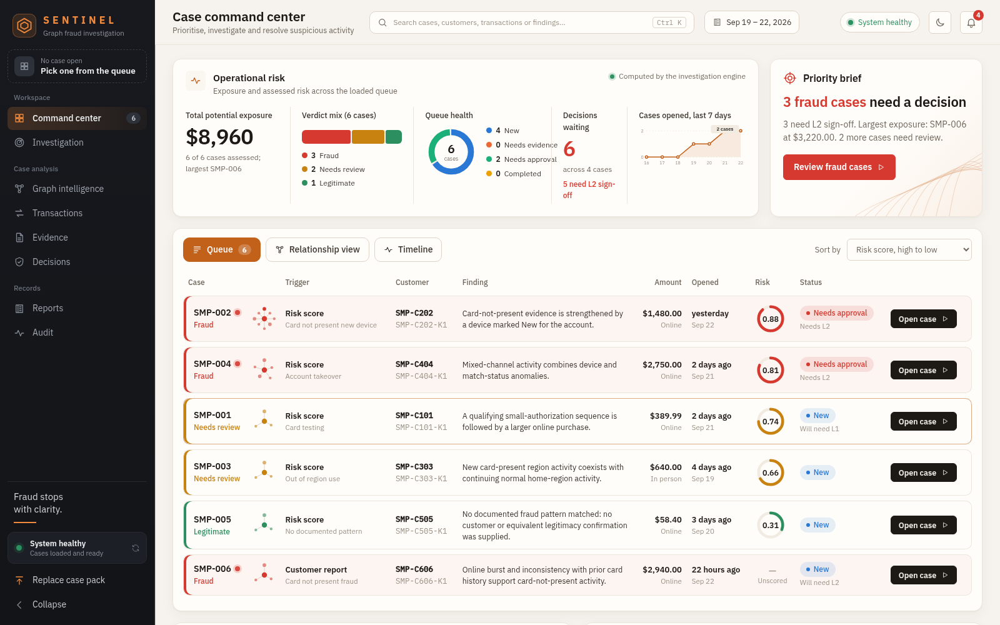
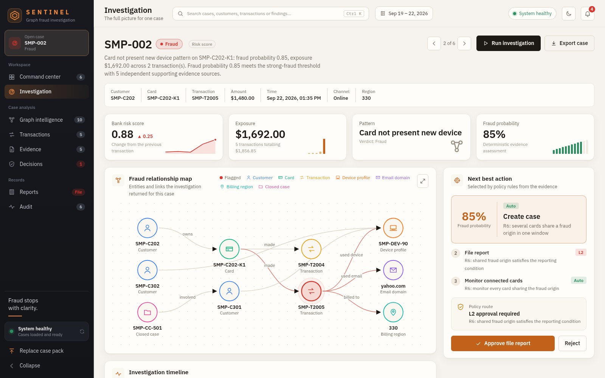
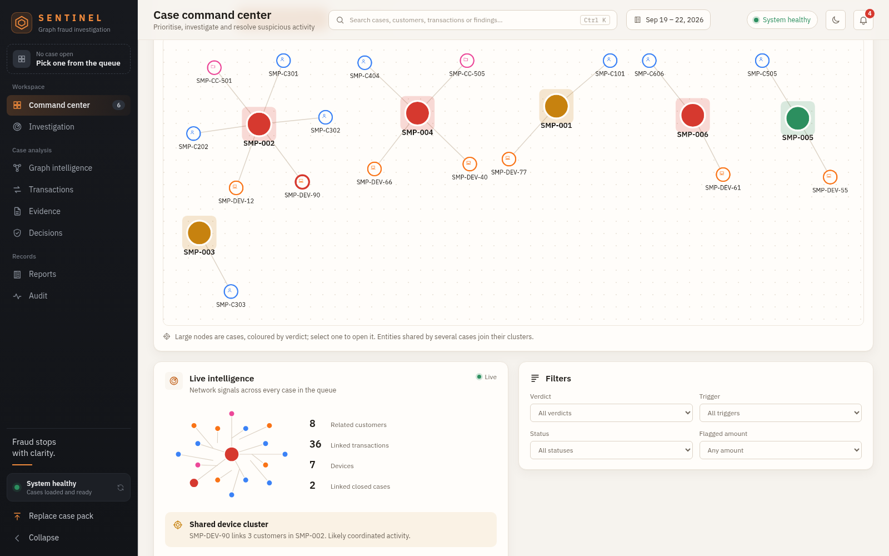
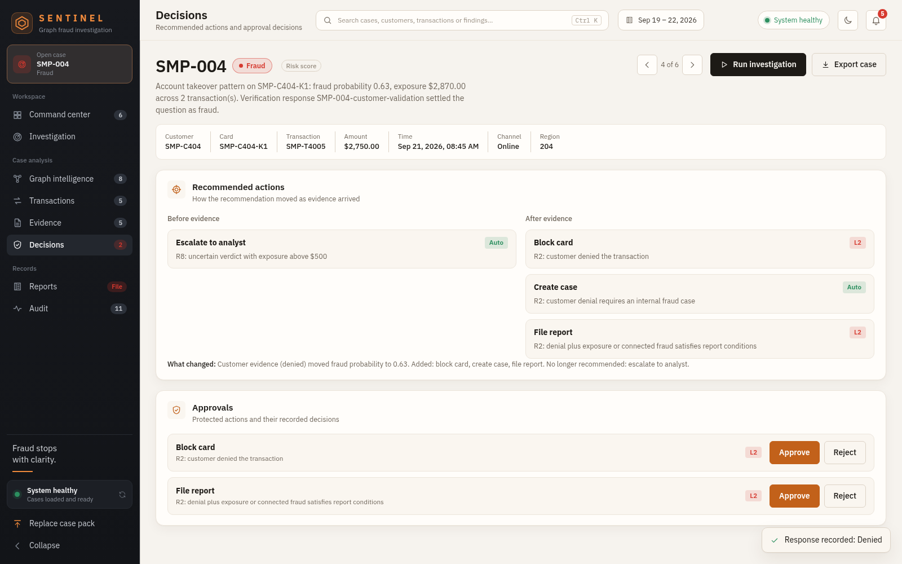
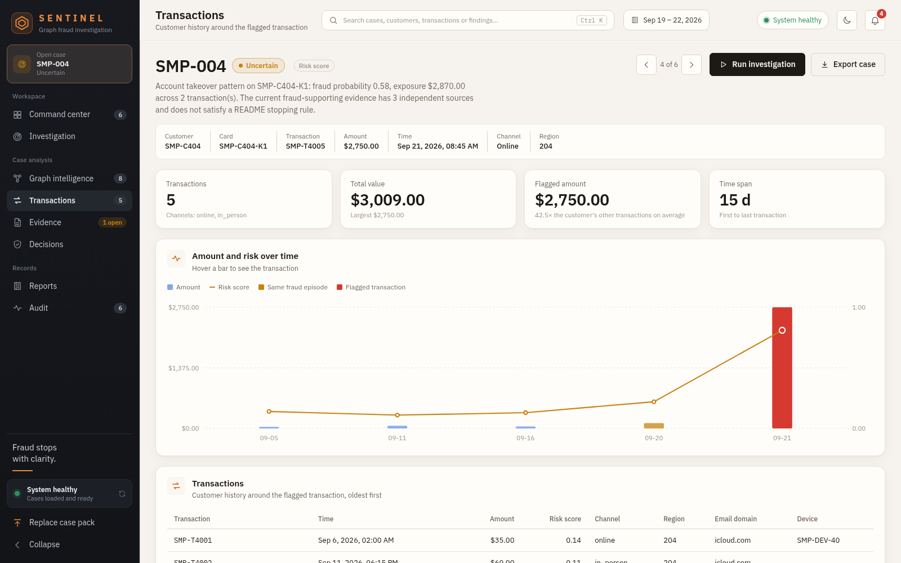
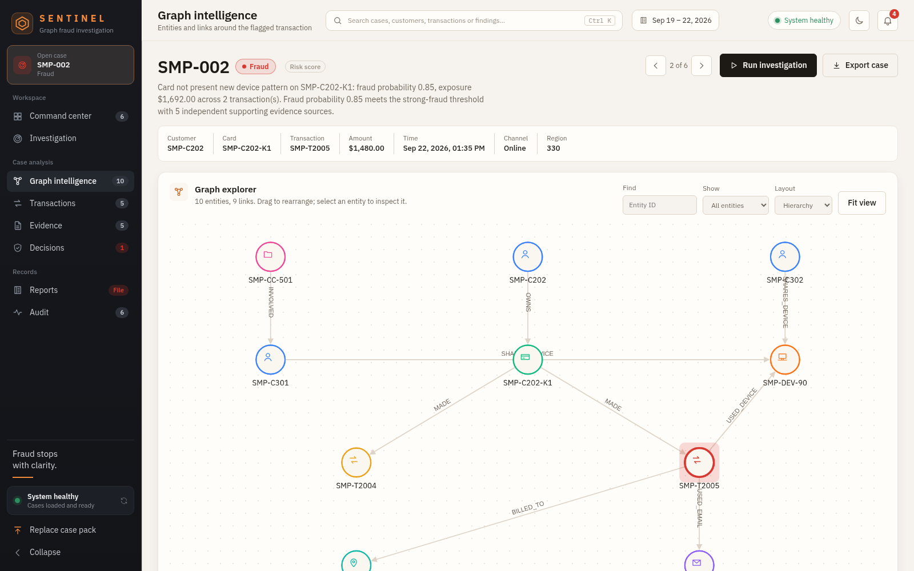
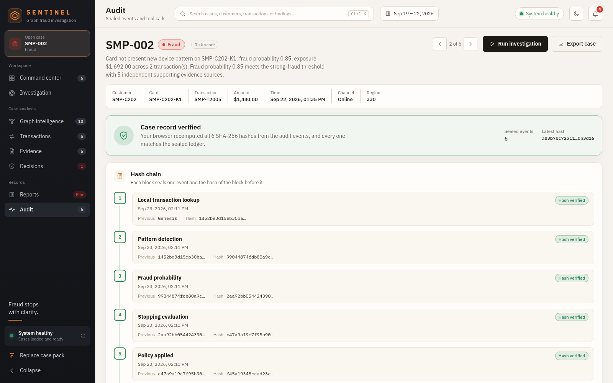
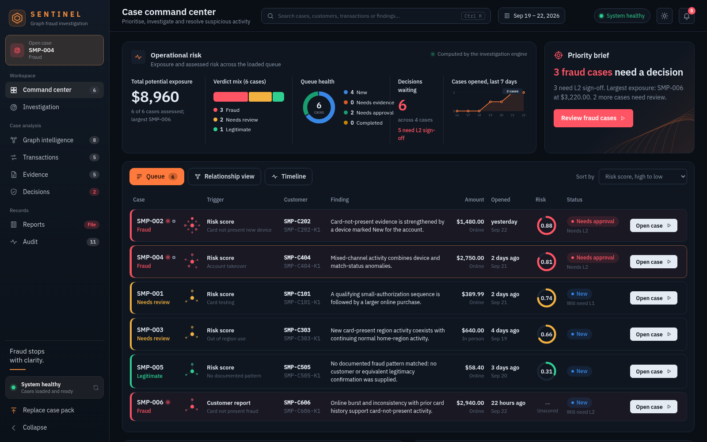
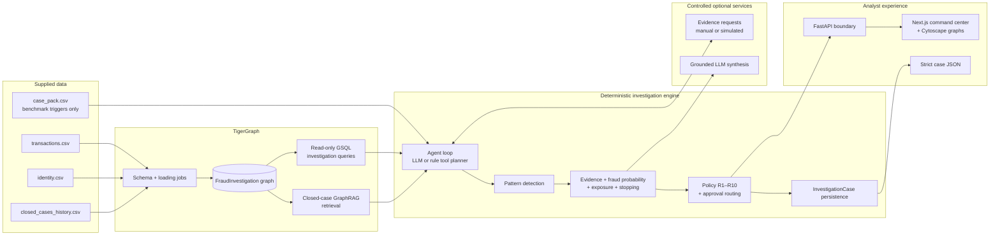

<div align="center">


# Sentinel

### Agentic fraud investigation on TigerGraph

**Graph evidence finds it. Deterministic policy decides it. A human approves it. The ledger proves it.**

[](https://www.python.org/)
[](https://fastapi.tiangolo.com/)
[](#-the-agent)
[](#-the-agent)
[](https://www.tigergraph.com/)
<br />
[](https://nextjs.org/)
[](https://react.dev/)
[](https://www.typescriptlang.org/)
[](https://js.cytoscape.org/)
<br />
[](tests/)
[](LICENSE)
[](#credits)

[Quick start](#-quick-start) · [Screenshots](#-a-look-inside) · [How it works](#-how-it-works) · [Sample cases](#-try-the-sample-cases) · [API](#-api) · [Credits](#credits)

<br />



</div>

<br />

## ✦ Why Sentinel

Most "AI fraud" demos let a language model look at a transaction and guess. Sentinel doesn't.

It is an **evidence-first investigation system** built for the Hacker House Goa challenge. A trigger opens a case. Graph queries gather the facts. Deterministic detectors, scoring and policy rules make the call. Protected actions wait for a named approval level. Every step is sealed into a SHA-256 hash chain that your browser can re-verify.

The language model is optional, and even when it is on it can only *explain*. It cannot invent IDs, change the fraud score, override policy or approve anything.

> **Nothing on screen is hard-coded.** Every number, finding, verdict and action in the workbench comes from the API. When something hasn't been assessed, the interface says so instead of filling the gap.

<br />

## ✦ Highlights

<table>
<tr>
<td width="33%" valign="top">

### 🧭 Case command center
Operational risk at a glance: total exposure, verdict mix, queue health, decisions waiting and the 7-day case trend. A **priority brief** names the cases that need a decision now.

</td>
<td width="33%" valign="top">

### 🕸️ Graph intelligence
A left-to-right relationship map of customer → card → transaction → device, email and region, plus linked closed cases. A full Cytoscape explorer with search, layouts and an entity inspector.

</td>
<td width="33%" valign="top">

### ⚖️ Controlled decisions
Policy rules **R1–R10** recommend actions. `auto` actions run; **L1/L2** actions wait for a recorded human decision. Evidence requests pause the case until the customer or a step-up check answers.

</td>
</tr>
<tr>
<td width="33%" valign="top">

### 📈 Deterministic scoring
A transparent weighted fraud probability from pattern strength, unusual amount, shared devices, new regions, linked confirmed cases, and customer and step-up evidence. No fitted model, no hidden labels.

</td>
<td width="33%" valign="top">

### 🔏 Verifiable audit
Every workflow event extends a SHA-256 chain. The audit view **recomputes each hash in the browser** and shows *Case record verified* only when every one matches.

</td>
<td width="33%" valign="top">

### 🌗 Built for analysts
Warm light and dark themes, keyboard search (<kbd>Ctrl</kbd> <kbd>K</kbd>), case stepping, a session activity trail, SAR copy and download, a case dossier export and a layout that works down to phone width.

</td>
</tr>
</table>

<br />

## ✦ A look inside

<table>
<tr>
<td width="50%"><p align="center"><b>Investigation</b><br /><sub>Key figures, relationship map, workflow timeline and the next best action</sub></p></td>
<td width="50%"><p align="center"><b>Relationship view</b><br /><sub>Every case and the customers, devices and closed cases it touches</sub></p></td>
</tr>
<tr>
<td width="50%"><p align="center"><b>Decisions</b><br /><sub>How the recommendation moved after the customer denied the purchase</sub></p></td>
<td width="50%"><p align="center"><b>Transactions</b><br /><sub>Amount and risk over time, with the fraud episode highlighted</sub></p></td>
</tr>
<tr>
<td width="50%"><p align="center"><b>Graph intelligence</b><br /><sub>Explore the subgraph with type colours, icons and entity search</sub></p></td>
<td width="50%"><p align="center"><b>Audit</b><br /><sub>Hash chain re-verified in the browser, with redacted raw events</sub></p></td>
</tr>
</table>

<div align="center">

<p><sub>The same command center in the dark theme, one click away in the header.</sub></p>
</div>

<br />

## 🤖 The agent

Every investigation is an explicit loop over **graph tools**. Each tool is an installed GSQL query called through the **official TigerGraph MCP server** (or, offline, the same question answered from the CSVs), and every call is recorded with the reason it ran.

| Tool | GSQL query | Why the agent calls it |
|---|---|---|
| `get_transaction` | `agent_txn_profile` | The flagged transaction with its card, device and identity signals |
| `get_customer_activity` | `agent_customer_activity` | The customer's baseline across every card |
| `get_device_activity` | `agent_device_activity` | Who else used the same device |
| `detect_device_ring` | `agent_device_ring` | Graph algorithm: bounded connected component around a shared or new device, to find fraud rings |
| `get_linked_closed_cases` | `agent_linked_closed_cases` | Prior investigations on the same customer, card or device users |
| `get_closed_cases_by_pattern` | `agent_closed_cases_by_pattern` | Case memory by detected pattern, with outcomes |
| `recall_case_memory` | `InvestigationCase` / memory store | The agent's own earlier investigations on these entities |
| `graphrag_retrieve` | `KnowledgeChunk` vector search | Policy passages and prior-case narratives closest to this case |

**Who picks the next tool.** With an OpenAI model configured, an **LLM planner** chooses each next graph tool from the tools that make sense at that moment, within a step budget, and must give a reason. It can only pick from the allow-list; an unknown tool, a malformed reply or a provider error hands the choice to the **rule planner**, and the trace says so. The planner decides *what to look at*. It never sees or sets the probability, the verdict, the actions or the approval routes. Without a model, the rule planner runs the investigator's default order.

**GraphRAG.** After assessing, the agent retrieves the policy passages, pattern documents and prior-case narratives closest to the case. With TigerGraph and embeddings configured, this is vector search over `KnowledgeChunk` vertices through MCP (`scripts/index_fraud_knowledge.py` builds the index); otherwise it is TF-IDF retrieval over the same documents. Retrieved passages appear as citations and similar cases, labelled with the method that found them, and are the only material the LLM narrative may use.

After the tools, the agent scores the evidence, checks the stopping rules, requests evidence if it needs more, applies policy R1–R10, cites the rule text behind each action, optionally writes a grounded LLM narrative, and writes the case back to TigerGraph.

### What makes it different

- **Decision paths (value of information).** Before asking for evidence, the agent simulates every possible answer to every request it could make (the customer denies, confirms or doesn't reply; step-up passes, fails or isn't completed) through the full assessment. It asks for the evidence whose answers lead to the most different decisions, and shows the analyst exactly what each answer would do before it arrives.
- **Counterfactual scoring.** A waterfall shows how many points each signal added to the fraud probability and how close the verdict sits to each threshold. Any signal whose removal alone would change the verdict is marked **decisive**, so analysts see which facts the decision really rests on.
- **Blast radius.** When a case looks like fraud, the agent uses the shared device and the fraud ring to list the *other* cards and customers at risk now, with their recent spend. One alert becomes protection for the whole ring.

### From dataset to submission

| Script | What it does |
|---|---|
| `scripts/setup_tigergraph.py` | Creates the schema and loading job, loads the data and installs every query (works on Savanna over REST) |
| `scripts/calibrate_closed_cases.py` | Replays closed cases through the agent with no label leakage and reports pattern and verdict agreement |
| `scripts/run_benchmark.py` | Answers every benchmark case: actions before and after evidence, labelled assumed responses, graph write, validation, report |

The full order of operations, down to the submission form, is in [docs/submission/RUNBOOK.md](docs/submission/RUNBOOK.md), alongside the [demo script](docs/submission/DEMO_SCRIPT.md), [blog post](docs/submission/BLOG_POST.md) and [social posts](docs/submission/SOCIAL_POSTS.md).

<br />

## 🚀 Quick start

You need **Python 3.11+** and **Node.js 20+**.

```bash
# 1. Backend dependencies
python -m venv .venv && source .venv/bin/activate
pip install -r requirements.txt

# 2. Start the API with the labelled sample cases
CASE_PACK_PATH=data/sample/case_pack.csv \
TRANSACTIONS_PATH=data/sample/transactions.csv \
CLOSED_CASES_PATH=data/sample/closed_cases_history.csv \
FRONTEND_ORIGINS=http://127.0.0.1:3001 \
python -m uvicorn backend.main:app --host 127.0.0.1 --port 8000

# 3. In a second terminal, start the workbench
cd frontend
npm install
printf 'NEXT_PUBLIC_API_BASE_URL=http://127.0.0.1:8000\n' > .env.local
npm run dev -- --port 3001
```

Open **http://127.0.0.1:3001**. A green **System healthy** badge means the API is up and cases are loaded.

To investigate the real benchmark instead, point `CASE_PACK_PATH` and `TRANSACTIONS_PATH` at the supplied files, or upload `case_pack.csv` from the sidebar. Nothing is loaded automatically.

<br />

## 🧪 Try the sample cases

`data/sample/` holds six synthetic cases (every ID starts with `SMP-`). They are not scripted: the local investigation engine runs the real detectors, weights, stopping rules, policy and SAR rules over the rows, so changing a row changes the outcome.

| Case | Scenario | What to try |
|---|---|---|
| **SMP-001** | Three sub-$5 online authorisations, then a $389.99 purchase on a new device | Answer the customer check with **Denied**: a card block joins the L1 decline |
| **SMP-002** | A new device shared with two other customers, one tied to a confirmed fraud case | Strong fraud straight away; the SAR needs **L2** sign-off |
| **SMP-003** | Card-present spending in a new region while home spending continues | Answer **Confirmed** and it closes as legitimate travel |
| **SMP-004** | Account takeover: new device, anonymous proxy, match-status change | Answer **Denied**: exposure over $2,500 routes the block to **L2** |
| **SMP-005** | A routine purchase that matches the card's history | Closes as legitimate with nothing to approve |
| **SMP-006** | Customer report of a $2,940 purchase at the end of an online burst | Card block (L2) and SAR (L2) are ready to approve |

More detail lives in [`data/sample/README.md`](data/sample/README.md).

<br />

## 🧠 How it works



### The investigation, step by step

1. **Trigger.** A case-pack row names the flagged transaction, customer, card and risk signal.
2. **Gather.** Read-only GSQL queries (or the local CSV engine) collect transaction, card, customer, device, region, email, connected-card and closed-case context.
3. **Detect.** Deterministic detectors look for card testing, card-not-present fraud (with or without a new device), out-of-region use, account takeover and coordinated undocumented abuse.
4. **Score.** A transparent weighted formula turns the evidence into a fraud probability, and the episode's transactions into exposure.
5. **Stop or ask.** Stopping rules decide whether the evidence settles the case. If not, the workflow asks the customer or requests step-up authentication, then resumes.
6. **Decide.** Policy rules R1–R10 recommend actions. `auto` actions may run; L1/L2 actions become approval requests.
7. **Report and seal.** SAR rules decide whether a report is required and draft it from facts only. Every step is sealed into the case's hash chain.

### Safety and decision boundaries

| Component | Responsible for | Not allowed to do |
|---|---|---|
| GSQL queries | Retrieve graph facts and relationships | Infer a verdict or approve actions |
| Deterministic investigation layer | Patterns, fraud probability, exposure, stop conditions | Use public fraud labels or hidden benchmark outcomes |
| Policy and approvals | R1–R10 recommendations and AUTO/L1/L2 routing | Silently execute L1/L2 actions |
| Evidence simulator | Explicit demo assumptions only | Claim simulation is customer or analyst fact |
| LLM synthesis | Grounded explanations and summaries | Invent IDs or facts, alter scores, override policy, or change the graph |
| Frontend | Visualisation and human interaction | Run fraud logic or create answers locally |

`risk_score` is a source input signal. It is never treated as a fraud verdict.

For the full component map and trust boundaries, see [docs/ARCHITECTURE.md](docs/ARCHITECTURE.md).

<br />

## 🖥️ The workbench

Every section can be opened before a case is. If no case is open, the section explains what it will show and offers a risk-sorted case picker that opens straight into it.

| Section | What it shows |
|---|---|
| **Command center** | Operational risk, priority brief, ranked queue with network glyphs and risk rings, relationship view, day-by-day timeline, live intelligence and filters |
| **Investigation** | Key figures, relationship map, workflow timeline, next best action with policy route, the agent's reasoning and explanation, evidence ledger and similar cases |
| **Graph intelligence** | The full returned subgraph with per-type colours and icons, four layouts, entity search and an inspector |
| **Transactions** | Customer history, amount and risk chart, and the flagged amount compared with the customer's others |
| **Evidence** | Evidence requests to answer, the ledger filtered by source, and similar closed cases |
| **Decisions** | Actions before and after evidence, approve or reject for protected actions, and the policy text behind each one |
| **Reports** | SAR decision, subjects, amount, dates and narrative, with copy and download |
| **Audit** | Hash chain verified in the browser, plus redacted raw events |

<br />

## 🔌 API

| Method | Path | Purpose |
|---|---|---|
| `GET` | `/health` | Liveness, and whether a workflow is configured |
| `GET` | `/ready` | `503` until a case provider and workflow are available |
| `POST` | `/setup/case-pack` | Load a `case_pack.csv` uploaded from the workbench |
| `GET` | `/cases` | Cases in the loaded pack |
| `GET` | `/cases/overview` | Every case with its current assessment, for the command center |
| `POST` | `/investigations/start` | Run the investigation for a case |
| `GET` | `/investigations/{case_id}` | Current investigation state |
| `POST` | `/investigations/{case_id}/evidence` | Record a customer, step-up or analyst response |
| `POST` | `/investigations/{case_id}/approval` | Approve or reject a protected action |

Set `APP_API_KEY` to require an `x-api-key` header, `APP_APPROVER_ROLE` to require `x-user-role` on approvals, and `APP_RATE_LIMIT_PER_MINUTE` for a per-process rate limit.

<br />

## ⚙️ Configuration

Keep credentials in environment variables or a secret manager. Never commit `.env` or `.env.local`.

| Variable | Used by | Purpose |
|---|---|---|
| `NEXT_PUBLIC_API_BASE_URL` | Frontend | Base URL of the running investigation API |
| `NEXT_PUBLIC_ANALYST_NAME` | Frontend | Optional analyst name shown in the header |
| `CASE_PACK_PATH` | API | Case pack loaded at start-up (it can also be uploaded) |
| `TRANSACTIONS_PATH` | API | Transactions for the timeline, charts, graph and assessment |
| `CLOSED_CASES_PATH` | API | Closed cases for linked prior fraud and similar cases |
| `IDENTITY_PATH` | API | `identity.csv`, for device profiles in CSV mode |
| `DATA_SOURCE` | API, scripts | `csv` (default) or `tigergraph` to answer the agent's tools over MCP |
| `POLICY_DOCS_PATH` | API, scripts | Policy, pattern and regulation documents the agent cites |
| `CASE_MEMORY_PATH` | API, scripts | Where the agent remembers its own finished investigations |
| `FRONTEND_ORIGINS` | API | Allowed browser origins (CORS) |
| `LLM_PROVIDER`, `LLM_MODEL` | LLM layer | Optional grounded synthesis provider and model |
| `OPENAI_API_KEY` | Optional provider | Authentication for LLM synthesis or embeddings |

The deterministic pipeline works with no LLM configured.

<br />

## 🗂️ Repository map

```text
backend/
  agent/               an alternative LangGraph formulation of the workflow (not used by the runtime agent)
  investigation/       patterns, evidence, scoring, exposure, stopping
  policy/              actions, R1–R10 rules, approvals, SAR policy
  evidence_requests/   request/response models and deterministic simulation
  cases/               InvestigationCase persistence
  app/                 TigerGraph, MCP, GraphRAG, LLM and output modules
  local_engine.py      the investigation agent: tool loop, assessment, policy, memory
  sources/             graph tools over TigerGraph MCP or the CSVs
  memory.py            case memory of the agent's own investigations
  main.py              thin FastAPI boundary
frontend/
  components/          command center, investigation views, graphs, audit
  lib/                 API client, types and formatting
tigergraph/            schema, loading jobs, read-only GSQL queries and agent tools
data/sample/           labelled synthetic cases for local exploration
scripts/               data preparation and validation commands
docs/                  dataset, schema, loading, query, MCP and architecture docs
tests/                 deterministic unit and integration tests
```

<br />

## 🐯 TigerGraph

The graph contains `Customer`, `Card`, `Transaction`, `DeviceProfile`, `EmailDomain`, `BillingRegion`, `ClosedCase` and system-created `InvestigationCase` vertices, with ownership, transaction, device, email, region, sequence, closed-case and connected-card relationships.

Prepare and validate the data before loading:

```bash
python scripts/prepare_graph_data.py --sample
python scripts/validate_data.py --sample 1000
```

Then install the schema, loading jobs and queries in your TigerGraph environment:

- [Schema](docs/TIGERGRAPH_SCHEMA.md) · [Data loading](docs/DATA_LOADING.md) · [GSQL queries](docs/GSQL_QUERIES.md) · [MCP integration](docs/TIGERGRAPH_MCP.md) · [GraphRAG](docs/GRAPHRAG.md)

The supplied dataset has one direct transaction/identity join, `TransactionID`. Read [docs/DATASET_ANALYSIS.md](docs/DATASET_ANALYSIS.md) before changing ingestion or graph design.

### Docker

```bash
CASE_PACK_DIR=/absolute/path/to/data docker compose up --build
```

A production deployment injects the TigerGraph-backed workflow and a real identity provider for analysts and approvers.

<br />

## ✅ Validation

```bash
pytest -q                      # 148 deterministic tests
cd frontend && npm run build   # type-checked production build
```

`scripts/validate_case_output.py` and `scripts/validate_all_cases.py` reject unknown entity IDs, invalid action routes, malformed probability or exposure values, invalid legitimate-case state and unverifiable graph writes.

<br />

## 🩺 Troubleshooting

| What you see | Meaning | Fix |
|---|---|---|
| **System healthy** | API and cases are ready | Pick a case from the command center |
| **Case pack needed** | The API is running with no cases | Upload `case_pack.csv` from the sidebar, or set `CASE_PACK_PATH` |
| **API offline** | The workbench can't reach `NEXT_PUBLIC_API_BASE_URL` | Start the API on port 8000 and check `frontend/.env.local` |
| **Not assessed** everywhere | No transactions were found for the cases | Set `TRANSACTIONS_PATH` to your `transactions.csv` |
| Missing chunks in dev | A stale Next.js cache | Stop the dev server, delete `frontend/.next`, run `npm run dev` |

<br />

## 📏 Project rules

- No Kaggle or public IEEE fraud labels, and no hidden case-pack answers.
- No invented meanings for unnamed `V*`, `C*`, `D*`, `M*` or opaque identity fields.
- No LLM override of graph evidence, scores, stopping, policy or approval routing.
- The benchmark `case_pack.csv` is a trigger set, never historical fraud truth.
- The historical data contains closed-case transaction/card-label mismatches. They are preserved and surfaced by validation, not hidden.

<br />

## 📚 Documentation

[Dataset analysis](docs/DATASET_ANALYSIS.md) · [Preprocessing](docs/PREPROCESSING.md) · [Architecture](docs/ARCHITECTURE.md) · [Manual case investigation](docs/MANUAL_CASE_INVESTIGATION.md) · [Hackathon demo playbook](docs/HACKATHON_DEMO.md) · [CI workflow](.github/workflows/ci.yml)

<br />

## Credits

<table>
<tr>
<td align="center" width="50%">
<a href="https://github.com/kartikeyajay2006"></a>
<br /><b>Kartikeya Yadav</b>
<br /><a href="https://github.com/kartikeyajay2006">@kartikeyajay2006</a>
<br /><sub>Case command center and analyst workbench, local investigation engine, sample dataset, tamper-evident ledger, demo playbook</sub>
</td>
<td align="center" width="50%">
<a href="https://github.com/ankit25bcs10610"></a>
<br /><b>Ankit Pandey</b>
<br /><a href="https://github.com/ankit25bcs10610">@ankit25bcs10610</a>
<br /><sub>API runtime, readiness and rate limiting, deployment, early workbench interface</sub>
</td>
</tr>
</table>

<div align="center">
<br />
<sub>Built for the <b>Hacker House Goa</b> challenge · Released under the <a href="LICENSE">MIT License</a></sub>
<br /><br />

<br />
<sub><i>Fraud stops with clarity.</i></sub>
</div>
