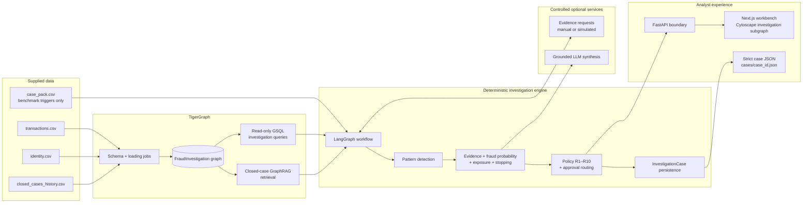

# TigerGraph Agentic Fraud Investigation

An evidence-first fraud-investigation system built for the Hacker House Goa challenge. It combines deterministic graph investigation, policy-controlled decisions, case memory, optional grounded LLM synthesis, and an analyst workbench.

The system is deliberately designed so that an LLM can explain evidence but cannot replace graph queries, change the fraud score, approve restricted actions, or fabricate facts.

## Demo in five minutes

The workbench is designed for a clean, explainable analyst demo: a case enters through the intake queue, the agent gathers graph-grounded context, policy determines the next best action, and the analyst can review evidence, uncertainty, approval routes, and an immutable audit trail in one place.

```bash
# 1. Create your local configuration (never commit this file).
cp .env.example .env

# 2. Point this to the supplied benchmark input.
# CASE_PACK_PATH=/absolute/path/to/case_pack.csv

# 3. Start the API with the same Python environment used for dependencies.
python -m uvicorn backend.main:app --host 127.0.0.1 --port 8000

# 4. In a second terminal, start the workbench.
cd frontend
npm install
printf 'NEXT_PUBLIC_API_BASE_URL=http://127.0.0.1:8000\n' > .env.local
npm run dev -- --port 3001
```

Open `http://127.0.0.1:3001`. A green **System ready** badge confirms that the API and benchmark case pack are available. An amber **Setup required** badge means the API is reachable but `CASE_PACK_PATH` still needs the absolute path to the supplied `case_pack.csv`; it is not an API outage.

> The reference runtime intentionally uses real case triggers only. It never creates invented benchmark cases or fabricated fraud decisions when the case pack is missing.

### Demo checklist

- Start with a trigger from the case intake queue.
- Open Graph Evidence to show relationships and grounded claims.
- Explain the risk, pattern, exposure, confidence, and remaining uncertainty.
- Show the controlled evidence-request branch when the policy requires more information.
- Show the Actions tab to distinguish recommendations from L1/L2 approval-required actions.
- Finish with SAR and Audit Trail views to demonstrate compliance-grade record keeping.

## What it does

- Builds a TigerGraph investigation graph from transaction, identity, and historical closed-case data.
- Uses installed GSQL queries as the source of graph evidence.
- Detects documented fraud patterns with deterministic rules.
- Calculates fraud probability transparently from configuration and evidence.
- Applies R1–R10 policy rules and routes protected actions to the appropriate human approval level.
- Supports explicit, reproducible simulated evidence for demos when real customer or analyst responses are unavailable.
- Persists system-created `InvestigationCase` records as future case memory.
- Produces validated JSON case outputs and an analyst-facing Next.js workbench.

## Safety and decision boundaries

| Component | Responsible for | Not allowed to do |
|---|---|---|
| GSQL queries | Retrieve graph facts and relationships | Infer a verdict or approve actions |
| Deterministic investigation layer | Patterns, fraud probability, exposure, stop conditions | Use public fraud labels or hidden benchmark outcomes |
| Policy and approvals | R1–R10 recommendations and AUTO/L1/L2 routing | Silently execute L1/L2 actions |
| Evidence simulator | Explicit demo assumptions only | Claim simulation is customer or analyst fact |
| LLM synthesis | Grounded explanations and summaries | Invent IDs/facts, alter scores, override policy, or mutate the graph |
| Frontend | Visualization and human interaction | Run fraud logic or create answers locally |

`risk_score` is a source input signal. It is never treated as a fraud verdict.

## Architecture



### Investigation flow

1. A benchmark trigger identifies the transaction, customer, card, and risk signal to investigate.
2. The workflow calls read-only GSQL queries for transaction, card, customer, device, region, email, connected-card, and historical-case context.
3. Deterministic detectors evaluate evidence and calculate the fraud probability, episode exposure, and stop condition.
4. If evidence is needed, the workflow pauses for a real response or records an explicit simulated assumption before resuming.
5. R1–R10 produce recommendations. AUTO actions may execute automatically; L1/L2 actions remain human-approval requests.
6. The system persists the resulting `InvestigationCase`, validates the final output, and presents the case to the analyst workbench.

For a detailed component map and trust boundaries, see [docs/ARCHITECTURE.md](docs/ARCHITECTURE.md).

## Repository map

```text
backend/
  agent/               LangGraph state, nodes, workflow, lifecycle service
  investigation/       patterns, evidence, scoring, exposure, stopping
  policy/              actions, R1–R10 rules, approvals, report policy
  evidence_requests/   request/response models and deterministic simulation
  cases/               InvestigationCase persistence
  app/                 TigerGraph, MCP, GraphRAG, LLM, output modules
  main.py              thin HTTP boundary (requires injected runtime services)

tigergraph/
  schema.gsql          graph schema
  loading_jobs.gsql    loading jobs
  queries/             read-only GSQL investigation primitives

scripts/               data preparation and validation commands
docs/                  dataset, schema, loading, query, MCP, and architecture docs
frontend/              Next.js + React + TypeScript + Tailwind + Cytoscape workbench
tests/                 deterministic unit and integration tests
```

## Data model

The graph contains `Customer`, `Card`, `Transaction`, `DeviceProfile`, `EmailDomain`, `BillingRegion`, `ClosedCase`, and system-created `InvestigationCase` vertices.

Key relationships include customer/card ownership, card transactions, device/email/region context, transaction sequence, closed-case involvement, connected cards, and the minimal system-case relationships needed for an investigation.

The supplied dataset has one direct transaction/identity join: `TransactionID`. The case files reference transactions and customers. The case `card_id` mapping must be validated from the deterministic data-preparation output; it must not be invented from opaque source fields.

Read [docs/DATASET_ANALYSIS.md](docs/DATASET_ANALYSIS.md) before changing ingestion or graph design.

## Setup

### Prerequisites

- Python 3.11+
- Node.js 20+
- TigerGraph instance and GSQL client for graph loading/query installation
- Optional: an LLM provider credential for grounded synthesis only

### Python environment

```bash
python -m venv .venv
source .venv/bin/activate
pip install -r requirements.txt
```

### Frontend

```bash
cd frontend
npm install
cp .env.example .env.local
npm run dev
```

Set `NEXT_PUBLIC_API_BASE_URL` in `frontend/.env.local` to the URL of the separately running investigation API. The frontend intentionally does not fall back to locally fabricated data when the API is unavailable.

### Local API reference runtime

The repository includes a trigger-only reference composition. It reads the real benchmark case pack, exposes `GET /cases`, and proves the API/frontend wiring without inventing fraud results. It deliberately stops before graph-backed investigation until a production workflow is injected:

```bash
cp .env.example .env
# Set CASE_PACK_PATH to the supplied case_pack.csv path.
set -a && source .env && set +a
uvicorn backend.main:app --reload --port 8000
```

The API exposes `GET /health`, `GET /ready`, `GET /cases`, investigation start/state, evidence response, and approval endpoints. Set `APP_API_KEY` to require an `x-api-key` header and `APP_APPROVER_ROLE` to require `x-user-role` on approval requests. Set `APP_RATE_LIMIT_PER_MINUTE` to a positive value to enable the per-process local rate limit. For a live frontend/API split, set `FRONTEND_ORIGINS` explicitly.

### Docker reference deployment

The reference API and workbench can be started with Docker after placing the supplied `case_pack.csv` in the configured data directory:

```bash
CASE_PACK_DIR=/absolute/path/to/data docker compose up --build
```

This packages the trigger-only API runtime. A production deployment must inject the real TigerGraph-backed workflow and use a proper identity provider for analyst authentication and approvals.

### TigerGraph

Prepare and validate source data before loading it. The scripts support a safe sample-first workflow:

```bash
python scripts/prepare_graph_data.py --sample
python scripts/validate_data.py --sample 1000
```

Then install the schema, loading jobs, and query files in the target TigerGraph environment. See:

- [docs/TIGERGRAPH_SCHEMA.md](docs/TIGERGRAPH_SCHEMA.md)
- [docs/DATA_LOADING.md](docs/DATA_LOADING.md)
- [docs/GSQL_QUERIES.md](docs/GSQL_QUERIES.md)

### Runtime composition note

`backend/main.py` intentionally provides a thin FastAPI boundary. A deployer must supply a configured workflow and benchmark-case provider that use the target TigerGraph environment. This avoids embedding dataset paths, graph credentials, or investigation outcomes in application code.

## Configuration

Use environment variables or deployment secret management for credentials. Never commit API keys, TigerGraph tokens, or `.env.local` files.

| Variable | Used by | Purpose |
|---|---|---|
| `NEXT_PUBLIC_API_BASE_URL` | Frontend | Base URL of the running investigation API |
| `LLM_PROVIDER` | LLM layer | Selects the configured synthesis provider |
| `LLM_MODEL` | LLM layer | Selects a provider-supported model |
| `OPENAI_API_KEY` | Optional OpenAI provider | Authentication for LLM synthesis |

The deterministic pipeline remains available if no LLM provider is configured.

For cost-conscious grounded summaries, use `LLM_PROVIDER=openai` and `LLM_MODEL=gpt-4o-mini`. Keep `OPENAI_API_KEY` only in your ignored local `.env` or your deployment secret manager. Embeddings are configured independently with `EMBEDDING_PROVIDER`, `EMBEDDING_MODEL`, and the same API key when using OpenAI embeddings.

## Runtime status and troubleshooting

| What you see | Meaning | Fix |
|---|---|---|
| **System ready** | API and case workflow are ready. | Select a case and begin the investigation. |
| **Setup required** | API is running, but the benchmark case pack is not configured. | Set `CASE_PACK_PATH` to the absolute `case_pack.csv` path and restart the API. |
| **API offline** | The frontend cannot reach `NEXT_PUBLIC_API_BASE_URL`. | Start the API, confirm port `8000`, and use `http://127.0.0.1:8000` in `frontend/.env.local`. |
| `503 /ready` | The API has started without its case provider/workflow. | This is expected until `CASE_PACK_PATH` or production adapters are supplied. |

If the Next.js development server reports missing generated chunks after a build or abrupt restart, stop the dev server, remove only `frontend/.next`, and run `npm run dev` again. `.next` is a generated cache and is safe to recreate.

## Validation

```bash
pytest -q
cd frontend && npm run build
```

Case output validators are available in `scripts/validate_case_output.py` and `scripts/validate_all_cases.py`. They reject unknown entity IDs, invalid action routes, malformed probability/exposure values, invalid legitimate-case state, and unverifiable graph writes.

## Documentation

- [Dataset analysis](docs/DATASET_ANALYSIS.md)
- [TigerGraph schema](docs/TIGERGRAPH_SCHEMA.md)
- [Data loading](docs/DATA_LOADING.md)
- [GSQL query reference](docs/GSQL_QUERIES.md)
- [Manual case investigation](docs/MANUAL_CASE_INVESTIGATION.md)
- [TigerGraph MCP integration](docs/TIGERGRAPH_MCP.md)
- [GraphRAG](docs/GRAPHRAG.md)
- [Architecture](docs/ARCHITECTURE.md)
- [CI workflow](.github/workflows/ci.yml)

## Project constraints

- Do not use Kaggle/public IEEE fraud labels or hidden case-pack answers.
- Do not infer semantic meanings for unnamed `V*`, `C*`, `D*`, `M*`, or opaque numeric identity fields.
- Do not let an LLM override deterministic graph evidence, scores, stopping, policy, or approval routing.
- Do not treat the benchmark `case_pack.csv` as historical fraud truth.

## Data-quality limitation

The supplied historical data contains closed-case transaction/card-label mismatches. These are preserved and surfaced by validation; card-based historical conclusions must not be treated as fully reliable until the source mapping is resolved. See [docs/DATASET_ANALYSIS.md](docs/DATASET_ANALYSIS.md) and the validation reports for the observed mismatch counts.

## Contributors

- Ankit Pandey
