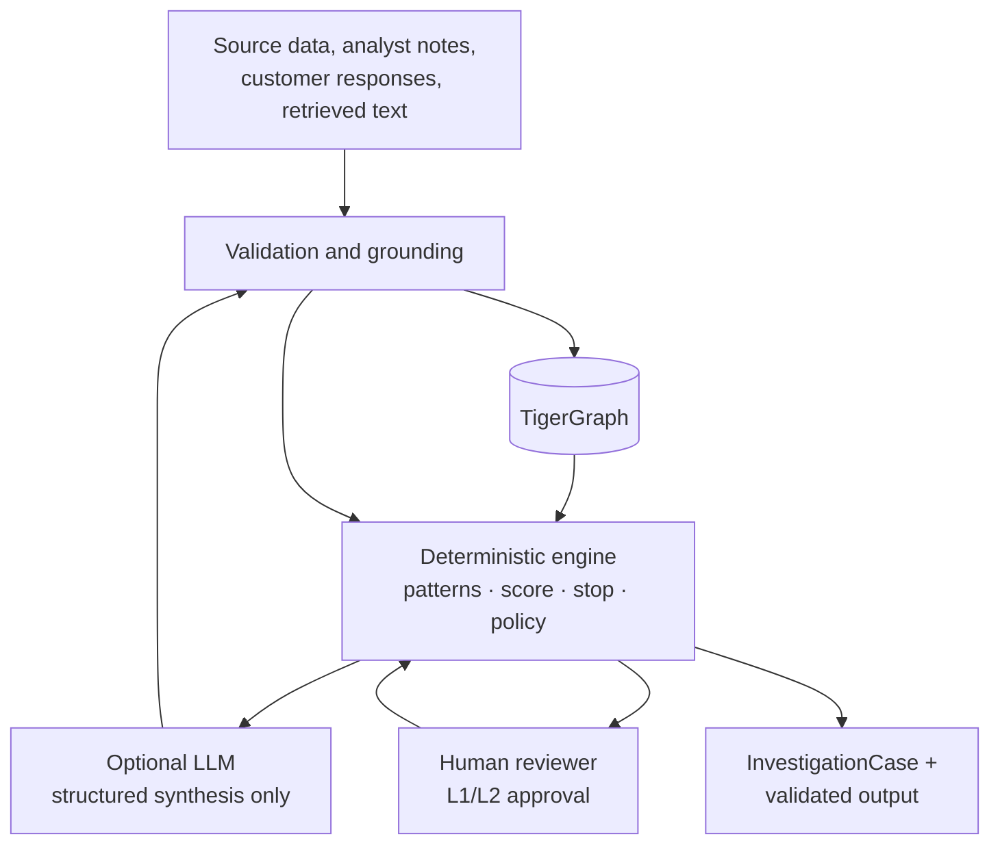
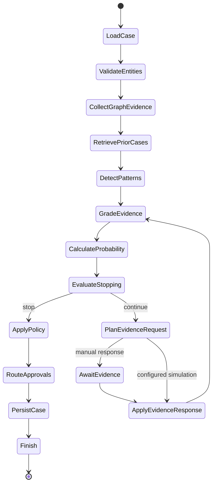
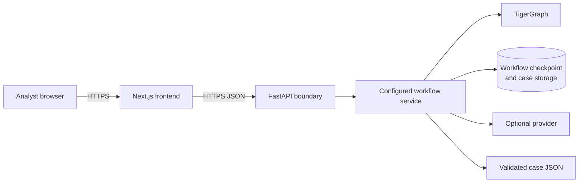

# System architecture

## Purpose

This document describes the implemented boundaries of the TigerGraph Agentic Fraud Investigation system. It is an investigation support system: deterministic application code makes detections, scores, policy recommendations, and stopping decisions. The optional LLM layer only produces grounded explanations.

## Layered design

| Layer | Components | Responsibility |
|---|---|---|
| Data | CSV files, preparation and validation scripts | Preserve source fields and validate joins, nulls, and references. |
| Graph | TigerGraph schema, loading jobs, GSQL queries | Store relationships and retrieve bounded, explainable investigation context. |
| Investigation | LangGraph workflow and investigation modules | Orchestrate evidence collection and run deterministic patterns, scoring, exposure, and stopping logic. |
| Decision controls | R1–R10 rules and approvals | Translate state into permitted recommendations and HUMAN approval routes. |
| Case memory | InvestigationCase persistence and validated output | Persist system conclusions and write strict challenge-compatible JSON. |
| Explanation | GraphRAG and optional LLM synthesis | Retrieve prior-case text and explain only supplied, grounded evidence. |
| Experience | FastAPI boundary and frontend workbench | Serve investigation state and support analyst review/approval. |

## Trust boundaries

Untrusted text is evidence, not instructions. This includes transaction text, analyst notes, GraphRAG documents, and data returned by external systems. The grounding validator rejects or removes unsupported LLM references.

## Graph responsibilities

GSQL is the authoritative retrieval layer. The workflow can use graph primitives such as `transaction_context`, `card_history`, `customer_history`, `card_window`, `device_neighbors`, `region_history`, `email_neighbors`, `connected_cards`, `prior_cases`, and `fraud_episode_candidates`.

The GSQL layer returns facts; it does not decide fraud. Conversely, the LLM does not replace GSQL retrieval and has no graph mutation tool.

## Investigation state machine

Simulation is reproducible and explicit. A simulated response carries `simulated: true` and a plain-language `assumption`; it is never represented as factual customer or analyst evidence.

## Controlled decision flow

1. Pattern detectors return supporting and contradicting evidence with strength.
2. Fraud probability uses configured deterministic weights. `risk_score` may contribute as an input but is never the decision itself.
3. The stopping engine applies its rule threshold and independent-evidence requirements.
4. Policy rules R1–R10 create action recommendations, each attributed to its rule.
5. Approval routing labels actions AUTO, L1, or L2. L1 and L2 recommendations remain pending until a human decision is returned.
6. Reporting eligibility and SAR amounts are deterministic. `FILE_REPORT` is L2; the system cannot record it as approved without a human approval.

## Deployment topology

The repository does not embed a TigerGraph endpoint, API key, benchmark outcome, or fixed local data path. Runtime composition supplies these through deployment configuration.

## Observability and audit

The final case output contains tool calls, evidence requests/responses, policy actions, token/latency metadata, stop reason, and graph-write status. The frontend may show these audit events but filters secrets such as API keys, tokens, credentials, and authorization headers.

## Known operational prerequisite

The graph must be loaded and GSQL queries must be installed before a configured workflow can conduct a live investigation. The frontend can render a case only after the API returns an investigation result; it does not manufacture a demo answer when the backend is unavailable.
